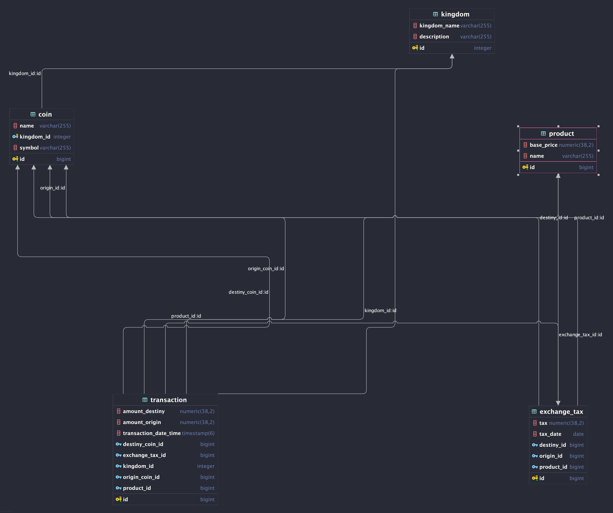

#  🏰 Sistema de Conversão de Moedas Medievais

Projeto desenvolvido para conversão de moedas entre reinos fictícios, utilizando diferentes produtos e taxas de câmbio personalizadas. Essa aplicação expõe uma API REST construída com **Spring Boot**, possui versionamento, documentação com **Swagger**, testes com **JUnit/Mockito**, e controle de taxa com estratégias dinâmicas.

---

## 🧱 Arquitetura e Componentes

- **Spring Boot 3+**
- **PostgreSQL**
- **JPA/Hibernate**
- **MapStruct** - mapeamento entre entidades e DTOs
- **Retry com Spring Retry** - para resiliência nas transações
- **Estratégia de conversão** via `ChangeStrategy`
- **Swagger/OpenAPI** - documentação interativa da API
- **JUnit + Mockito** - cobertura de testes de serviço e controller
- **SQL Script** - estrutura de banco e dados iniciais
- **Modelagem relacional** com MER

---

## 📦 Entidades principais

| Entidade      | Descrição                                       |
|---------------|--------------------------------------------------|
| `Kingdom`     | Reino responsável por uma moeda                  |
| `Coin`        | Moeda associada a um reino                       |
| `Product`     | Produto com preço base utilizado nas trocas      |
| `ExchangeTax` | Taxa de conversão entre moedas por produto       |
| `Transaction` | Transação de conversão registrada no sistema     |

---

## 📈 Fluxo de Conversão

1. Um reino possui uma ou mais moedas (`Coin`).
2. Produtos têm preços base (`Product.basePrice`).
3. As conversões entre moedas dependem da **ExchangeTax** específica para aquele produto.
4. Estratégias de conversão podem variar conforme o produto (`ChangeStrategy`).
5. As transações são registradas com os valores originais, convertidos, e o contexto da operação.

---

## 🔌 Endpoints Principais

| Método | Endpoint                    | Descrição                                |
|--------|-----------------------------|------------------------------------------|
| POST   | `/v1/product`               | Cria um novo produto                     |
| POST   | `/v1/coin`                  | Cria uma nova moeda                      |
| POST   | `/v1/exchange-tax`         | Define uma nova taxa de câmbio          |
| POST   | `/v1/transaction`           | Realiza uma conversão e registra        |
| GET    | `/v1/transaction/search-compact` | Lista as transações de forma resumida |
| GET    | `/v1/transaction/search-full`    | Lista as transações completas          |

> A documentação completa pode ser acessada via Swagger em:  
> `http://localhost:8080/api/swagger-ui/index.html#/`

---

## 🧪 Testes

- **Cobertura**
    - Serviços  possuem cobertura de testes com **JUnit 5** e **Mockito**.

- **Melhores práticas**

    - Uso de `@MockBean` (deprecado nas versões novas, substituir futuramente por `@TestConfiguration` com `@Mock`)
    - Testes em serviços validam comportamento de conversão, busca e exceções.

---

## 🧬 MER (Modelo Entidade Relacionamento)



> Script completo para recriar o banco: [`script.sql`](src/main/resources/script.sql)

---

## ▶️ Executando o Projeto

```bash
# 1. Build
./mvnw clean install

# 2. Rodar local
./mvnw spring-boot:run
